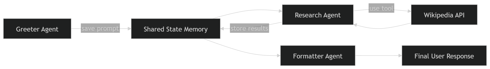

----------------------

# README Architecture(tutorial copy):
1️⃣ Lab explanation  
2️⃣ ADK architecture  
3️⃣ Mental models  
4️⃣ Visual diagrams  
5️⃣ Debugging errors  
6️⃣ Deployment pipeline  
7️⃣ **10-minute rebuild checklist**

---------------------------

# 🦁 Zoo Guide Agent (ADK + Cloud Run) — Complete Lab Notes

These are my **detailed personal notes** for understanding the **Google ADK Zoo Guide Agent Lab**.

This document explains:

- What the lab was actually about
- What every component does
- How the agent architecture works
- Why Cloud Run was used
- How deployment works
- What each command means
- How to avoid charges

This is **NOT a professional project README**.  
This is **a study reference so I can revisit the lab later and immediately understand everything again.**

---

# 1️⃣ What This Lab Was About

The goal of this lab was to:

1. Build an **AI Agent using Google's Agent Development Kit (ADK)**
2. Give the agent **tools** (Wikipedia)
3. Structure it using **multiple agents working together**
4. Deploy the agent as a **serverless web service**
5. Host it using **Google Cloud Run**

The final system becomes a **Zoo Tour Guide AI** that can answer questions about animals.

Example user question:
Where can I find the polar bears and what do they eat?

The system then:

1. Understands the question
2. Uses Wikipedia to gather information
3. Processes the information
4. Returns a friendly answer

---

# 2️⃣ What is an AI Agent?

An **AI Agent** is not just a chatbot.
A normal chatbot works like this:
User → LLM → Response

But an **AI Agent** works like this:
User → Agent → Tools → Data → LLM → Response

Agents can:
- use APIs
- query databases
- call external services
- reason about tasks
- break problems into steps

So the key difference is:

| Chatbot | Agent |
|------|------|
| Just text generation | Can perform actions |
| No tools | Uses tools |
| One step | Multi-step reasoning |

---

# 3️⃣ What is Google ADK?

ADK stands for:
Agent Development Kit
It is Google's framework for building AI agents.

ADK helps organize:
- tools
- agents
- workflows
- state
- agent communication

Without ADK, building complex agents becomes messy.

ADK lets us create structured agents like:
Greeter Agent
↓
Research Agent
↓
Formatter Agent

---

# 4️⃣ Architecture of the Zoo Agent

The system contains **three agents working together**.
User
↓
Greeter Agent
↓
Sequential Workflow
↓
Research Agent
↓
Formatter Agent
↓
Response

---

# 5️⃣ Agents Used in This Lab

## 1️⃣ Greeter Agent

This is the **entry point** of the system.

Responsibilities:

- start the conversation
- greet the user
- capture the user's prompt
- send it to the workflow

Example:
Hello! I'm your Zoo Tour Guide.
What animal would you like to learn about?

When the user asks a question, the Greeter:

1. saves the prompt
2. passes control to the workflow

---

## 2️⃣ Research Agent

This is the **brain of the system**.

Responsibilities:

- analyze the user question
- determine what information is needed
- decide which tools to use
- gather information

Example decision logic:
User asks about animal diet
↓
Use Wikipedia tool
↓
Fetch information

The research results are stored as:
research_data

---

## 3️⃣ Response Formatter Agent

This agent is responsible for:

- turning raw research into a nice answer
- making the response conversational
- combining multiple pieces of information

Example transformation:

Raw Data:
Lions are carnivores
They hunt zebras and antelope

Formatted Response:
Lions are carnivorous animals. In the wild they mainly hunt animals like zebras and antelopes.

---

# 6️⃣ Sequential Agent Workflow

The workflow agent ensures agents run **in a specific order**.
Research Agent
↓
Formatter Agent

This guarantees:

- data is gathered first
- response is generated second

ADK class used:
SequentialAgent

---

# 7️⃣ Tools Used by the Agent

Agents become powerful when they use tools.

In this lab we used:

## Wikipedia Tool

This allows the agent to fetch knowledge.
Library used:
LangChain WikipediaQueryRun

Example:
User asks:
What do lions eat?
The agent:
Calls Wikipedia API
↓
Retrieves facts
↓
Formats answer

---

# 8️⃣ Why Deploy to Cloud Run?

Running locally:
python main.py

Only works on **your computer**.

But deploying to Cloud Run makes it:
- accessible online
- scalable
- serverless

Cloud Run provides a **public URL**.

Example:
https://zoo-tour-guide-123456.run.app

Anyone with this link can access the agent.

---

# 9️⃣ What is Cloud Run?

Cloud Run is a **serverless platform for running containers**.

Instead of managing servers, Google handles:

- infrastructure
- scaling
- networking
- availability

We only provide the container.

---

# 🔟 Cloud Run Key Features

### Serverless

No server management required.

---

### Auto Scaling

0 users → 0 instances
100 users → multiple instances

---

### Pay for What You Use

Billing occurs only when:

- requests arrive
- compute is used

---

### Stateless

Each request may run on a different instance.
Persistent data should be stored externally.

Example:
Firestore
Cloud SQL
Memorystore

---

# 11️⃣ APIs Required for the Lab

We enabled several Google Cloud APIs.

## Cloud Run API

Allows deploying containerized services.
run.googleapis.com

---

## Artifact Registry API

Stores Docker container images.
artifactregistry.googleapis.com

Think of it as:
Google Drive for Docker images

---

## Cloud Build API

Builds containers automatically.
cloudbuild.googleapis.com

Equivalent to:
docker build
but executed in the cloud.

---

## Vertex AI API

Allows our agent to use Gemini models.
aiplatform.googleapis.com

---

## Compute Engine API

Provides underlying infrastructure resources.
compute.googleapis.com

---

# 12️⃣ Project Structure

Final project structure:
zoo_guide_agent/

├── .env
├── init.py
├── agent.py
└── requirements.txt

---

# 13️⃣ requirements.txt

google-adk==1.14.0
langchain-community==0.3.27
wikipedia==1.4.0

---

# 14️⃣ Environment Variables

Stored in:
.env

Example:
PROJECT_ID=xxxx
PROJECT_NUMBER=xxxx
SA_NAME=lab2-cr-service
SERVICE_ACCOUNT=lab2-cr-service@project.iam.gserviceaccount.com
MODEL=gemini-2.5-flash

These variables allow the code to:
- access Google Cloud services
- call Gemini models

---

# 15️⃣ Service Account

We created a **dedicated identity** for the application.
Purpose:
- allow the agent to call Vertex AI
- follow security best practices

Creation command:
gcloud iam service-accounts create ${SA_NAME}
Grant permission:
roles/aiplatform.user

---

# 16️⃣ Deployment Process

The deployment command:
uvx --from google-adk==1.14.0
adk deploy cloud_run
--project=$PROJECT_ID
--region=europe-west1
--service_name=zoo-tour-guide
--with_ui
.
--
--service-account=$SERVICE_ACCOUNT

This command automatically:
1. packages the project
2. builds a Docker container
3. uploads the image
4. deploys to Cloud Run
5. generates a public URL

---

# 17️⃣ Testing the Agent

Open the Cloud Run URL.
Example:
https://zoo-tour-guide-xxxx.run.app

You will see the **ADK UI**.
Enable:
Token Streaming
Then test:
Hello
Example question:
Where can I find the polar bears and what do they eat?

---

# 18️⃣ Full Agent Flow

The system operates like a **team of specialists**.

### Step 1 — Greeter

Captures the user prompt.

---

### Step 2 — Research Agent

Analyzes question and gathers information.
Possible sources:
- Wikipedia
- internal zoo data

---

### Step 3 — Formatter Agent

Creates the final answer.

---

# 19️⃣ Cleaning Up Resources

To avoid charges, resources must be deleted.

Delete Cloud Run service:
gcloud run services delete zoo-tour-guide --region=europe-west1
Delete container registry:
gcloud artifacts repositories delete cloud-run-source-deploy --location=europe-west1
Delete entire project:
gcloud projects delete $PROJECT_ID

Deleting the project removes:
- Cloud Run services
- Service accounts
- container images
- all APIs

---

# 20️⃣ What I Learned From This Lab

This lab taught me:

- how AI agents work
- how to structure multi-agent workflows
- how to integrate tools like Wikipedia
- how to deploy Python applications to Cloud Run
- how IAM service accounts secure cloud services
- how to manage and clean up cloud infrastructure

---

# 🧠 Final Summary

In this lab I built a **multi-agent AI Zoo Tour Guide** using:
- Google ADK
- Gemini models
- Wikipedia API
- Cloud Run
The system used **multiple specialized agents** working together to answer

---

# 🧠 Mental Models for Understanding ADK Agents

When revisiting this project later, the easiest way to understand it is through a few **mental models**.
These simplify the entire architecture.

---

# 🧠 Mental Model 1 — The Zoo Staff Analogy

Think of the system like a **zoo information desk staffed by employees**.
Each employee has a specific role.
Visitor
↓
Greeter
↓
Researcher
↓
Presenter
↓
Visitor gets answer

### Roles

| Agent | Real World Analogy | Job |
|------|------|------|
| Greeter | Front Desk | Talks to visitor |
| Researcher | Librarian | Finds information |
| Formatter | Tour Guide | Explains information nicely |

---

# 🧠 Mental Model 2 — Agent = Brain + Tools

An agent by itself is just a language model.
It becomes powerful only when it gets **tools**.
Agent
+
Tools
+
Instructions

AI System

In this lab:
Agent
+
Wikipedia Tool
+
Gemini Model

Result:
Zoo Tour Guide AI

---

# 🧠 Mental Model 3 — Agents Passing Memory

Agents share information using **state memory**.
User Question
↓
Saved to State
↓
Research Agent reads state
↓
Research results stored
↓
Formatter reads results

State acts like a **shared notebook between agents**.
Example:
State = {
PROMPT: "tell me about lions",
research_data: "...facts..."
}

---

# 🧠 Mental Model 4 — ADK Workflow

ADK allows agents to work together.
Workflow types include:
| Workflow | Meaning |
|------|------|
| SequentialAgent | Run agents one by one |
| ParallelAgent | Run agents simultaneously |
| RouterAgent | Decide which agent to use |

In this lab we used:
SequentialAgent
Because:
Research must happen before formatting

---

# 🧠 Mental Model 5 — Tool Usage

When the agent receives a question it decides:
Can I answer this?
If not:
Use tool
Example flow:
User: What do lions eat?
↓
Agent thinks
↓
Needs information
↓
Calls Wikipedia tool
↓
Gets facts
↓
Formats answer

This is **tool-augmented reasoning**.

---

# 🧠 Mental Model 6 — Deployment Pipeline

Think of deployment as a pipeline.
Python Code
↓
Container Image
↓
Artifact Registry
↓
Cloud Run
↓
Public URL

Cloud Run then automatically handles:
Scaling
Infrastructure
Networking
Security

---

# 🧠 Mental Model 7 — Cloud Run = Smart Vending Machine

Cloud Run behaves like a vending machine.
No users → machine off
User arrives → machine turns on
User request → machine serves
User leaves → machine shuts down

Benefits:
Zero idle cost
Automatic scaling
Serverless infrastructure

---

# 🧠 Mental Model 8 — Why Service Accounts Exist

Service accounts are **identities for applications**.
Instead of:
App using your personal Google account
We create:
App identity
Example:
lab2-cr-service@project.iam.gserviceaccount.com
This identity gets only the permissions it needs.

In this lab:
roles/aiplatform.user
Which allows calling **Gemini models**.

---

# 🧠 Mental Model 9 — Full System Flow

This is the **complete system execution flow**.
User opens Cloud Run URL
↓
FastAPI / ADK server receives request
↓
root_agent starts conversation
↓
Greeter saves prompt
↓
Sequential workflow starts
↓
Research agent gathers data
↓
Formatter agent builds response
↓
Final response returned to UI

---

# 🧠 Mental Model 10 — What Actually Happens During Deployment

The deployment command looks simple:
adk deploy cloud_run

But internally Google Cloud does:
1 Build container image
2 Push image to Artifact Registry
3 Create Cloud Run service
4 Assign service account
5 Connect to Vertex AI
6 Generate public URL

So **one command automates an entire DevOps pipeline**.

---

# 🎯 The One Sentence Summary

If I ever revisit this project later, remember:

This lab built a multi-agent AI Zoo Guide using Google's ADK, gave it Wikipedia as a tool, and deployed it as a serverless web service on Cloud Run using a secure service account.

---

# 📚 Key Concepts to Remember

The core ideas behind this lab were:

- Agent Architecture
- Tool Usage
- Multi-Agent Workflows
- Serverless Deployment
- Cloud IAM Security
- Containerized Applications

Understanding these concepts is the **foundation of modern AI application architecture.

---

# 🧩 Visual Architecture Diagrams

These diagrams help visualize how the **Zoo Guide Agent system works**.

---

# 1️⃣ Overall System Architecture
[User / Visitor]
           │
           ▼
 [Cloud Run Public URL]
           │
           ▼
 [ADK Server / FastAPI]
           │
           ▼
     [Greeter Agent]
           │
           ▼
  [Sequential Workflow]
           │
           ▼
    [Research Agent] ────────► [Shared Agent State]
           │  ▲
           ▼  │
    [Wikipedia Tool]
           │
           ▼ (From Research Agent)
[Response Formatter Agent]
           │
           ▼
     [Final Answer]
           │
           ▼
    [User / Visitor]

# 2️⃣ Agent Workflow

This shows how the agents interact internally.

# 3️⃣ Tool Usage Flow

This shows how the agent decides to use tools.
.png)

# 4️⃣ Cloud Deployment Pipeline

This shows what happens when running the deploy command.
.png)

# 5️⃣ Runtime Request Flow

This shows what happens when a user asks a question.
.png)

-----------------------------------------

# 🐞 Common Errors Faced During the Lab (and Fixes)

During the lab several issues occurred while deploying the agent to Google Cloud Run.  
These notes explain **why those errors happen and how to fix them quickly**.

---

# Error 1 — Service Account Already Exists

### Error

ERROR: Service account lab2-cr-service already exists

### Cause

The service account was already created in a previous attempt.
Cloud resources persist even if your terminal session restarts.

### Fix

Do **NOT create it again**.
Simply continue with the next step.

You can confirm existing service accounts using:
gcloud iam service-accounts list

---

# Error 2 — Invalid Service Account

### Error

Invalid service account ()

### Cause

The environment variable `$SERVICE_ACCOUNT` was empty.
This happens because **Cloud Shell resets variables when the session restarts**.

### Fix

Re-export the variable:
export SERVICE_ACCOUNT=lab2-cr-service@$PROJECT_ID.iam.gserviceaccount.com

Verify with:
echo $SERVICE_ACCOUNT

---

# Error 3 — No Active Account Selected

### Error

You do not currently have an active account selected

### Cause

The Cloud Shell session lost authentication.
This can happen when:
- reopening Cloud Shell
- refreshing the browser
- switching projects

### Fix

Run:
gcloud auth login
Then reselect your project:
gcloud config set project PROJECT_ID

---

# Error 4 — Missing Environment Variables

Sometimes `.env` variables are not loaded automatically.

### Fix

Run:
source .env
This reloads all environment variables into the terminal session.

---

# Error 5 — Container Failed to Start

### Error

The user-provided container failed to start and listen on PORT=8080

### Cause

Cloud Run expects the application to listen on **port 8080**.
If the server does not start correctly, deployment fails.

### Fix

Ensure the application starts properly and binds to the expected port.
Most ADK deployments handle this automatically when using:
adk deploy cloud_run

---

# Error 6 — APIs Not Enabled

### Error

Deployment fails because required services are unavailable.

### Fix

Enable required APIs:
gcloud services enable
run.googleapis.com
artifactregistry.googleapis.com
cloudbuild.googleapis.com
aiplatform.googleapis.com
compute.googleapis.com

---

# Error 7 — Cloud Shell Variables Reset

Cloud Shell sessions are temporary.
When the session restarts, variables like these disappear:
PROJECT_ID
PROJECT_NUMBER
SERVICE_ACCOUNT
SA_NAME

### Fix

Reload `.env` or export them again.

---

# 🧹 Preventing Unexpected Cloud Charges

Cloud resources can incur costs if left running.
To prevent this:

### Delete Cloud Run service

gcloud run services delete zoo-tour-guide --region=europe-west1

---

### Delete container registry

gcloud artifacts repositories delete cloud-run-source-deploy --location=europe-west1

---

### Delete entire project (safest)

gcloud projects delete $PROJECT_ID
Deleting the project removes:
- Cloud Run services
- Service accounts
- container images
- build artifacts
- enabled APIs

This guarantees **no future billing**.

---

# 📌 Quick Setup Commands (When Re-running the Lab)

If Cloud Shell restarts, run this setup block:
gcloud auth login
gcloud config set project PROJECT_ID
source .env

This restores authentication and environment variables.

---

# 🧠 Key Lesson From the Errors

Most problems in this lab were caused by:
- environment variables not loaded
- authentication not set
- resources already existing

These are common issues when working with **cloud infrastructure and CLI tools**.
Once understood, they become easy to fix.

---

# 🧪 How to Re-Run This Entire Lab From Scratch (10-Minute Checklist)

This section is a **quick restart guide** for rebuilding the Zoo Guide Agent if I revisit this project later.
Instead of rereading the whole README, I can follow these steps.

---

# Step 1 — Create or Select a Google Cloud Project

Open the Google Cloud Console.
Create a new project or select an existing one.
Then set it in Cloud Shell:
gcloud config set project PROJECT_ID
Verify:
gcloud projects list

------

# Step 2 — Enable Required APIs

Run:

gcloud services enable \
run.googleapis.com \
artifactregistry.googleapis.com \
cloudbuild.googleapis.com \
aiplatform.googleapis.com \
compute.googleapis.com

hese APIs enable:

API	                          Purpose
Cloud Run	               Deploy container services
Artifact Registry	       Store container images
Cloud Build	               Build Docker images
Vertex AI	               Access Gemini models
Compute Engine	           Required infrastructure

# Step 3 — Clone the Project Repository
Clone the repo:
git clone https://github.com/safaltasaxena/Zoo_Guide_agent.git
Move into the folder:
cd Zoo_Guide_agent

-------

# Step 4 — Create Virtual Environment

Create Python environment:
uv venv
Activate it:
source .venv/bin/activate

---------------

# Step 5 — Install Dependencies

Install required packages:
uv pip install -r requirements.txt

------------------

# Step 6 — Create Environment Variables

Create .env file.
Example:
PROJECT_ID=your-project-id
PROJECT_NUMBER=your-project-number
SA_NAME=lab2-cr-service
SERVICE_ACCOUNT=lab2-cr-service@PROJECT_ID.iam.gserviceaccount.com
MODEL=gemini-2.5-flash

Load environment variables:
source .env

-----------------

# Step 7 — Create Service Account

Create service account:
gcloud iam service-accounts create ${SA_NAME}

Grant Vertex AI access:
gcloud projects add-iam-policy-binding $PROJECT_ID \
--member="serviceAccount:$SERVICE_ACCOUNT" \
--role="roles/aiplatform.user"

--------------------

# Step 8 — Deploy the Agent

Run the deployment command:
uvx --from google-adk==1.14.0 \
adk deploy cloud_run \
--project=$PROJECT_ID \
--region=europe-west1 \
--service_name=zoo-tour-guide \
--with_ui \
. \
-- \
--service-account=$SERVICE_ACCOUNT

This command automatically:
1.builds the container
2.pushes it to Artifact Registry
3.deploys the service to Cloud Run
4.generates a public URL

--------------------

# Step 9 — Test the Agent

Open the Cloud Run URL.
Example:
https://zoo-tour-guide-xxxxx.run.app

Enable:
Token Streaming

Test questions:
Hello
Tell me about lions
Where can I find the polar bears and what do they eat?

--------------

# Step 10 — Clean Up to Avoid Charges

Delete the Cloud Run service:
gcloud run services delete zoo-tour-guide --region=europe-west1
Delete container registry:
gcloud artifacts repositories delete cloud-run-source-deploy --location=europe-west1
Or delete the entire project:
gcloud projects delete $PROJECT_ID

------

# ⚡ Ultra Quick Restart Summary

If I want to redo the entire lab quickly:

1. Set project
2. Enable APIs
3. Clone repo
4. Activate venv
5. Install requirements
6. Setup .env
7. Create service account
8. Deploy with adk deploy
9. Test URL
10. Delete resources

---------------------------------------------
